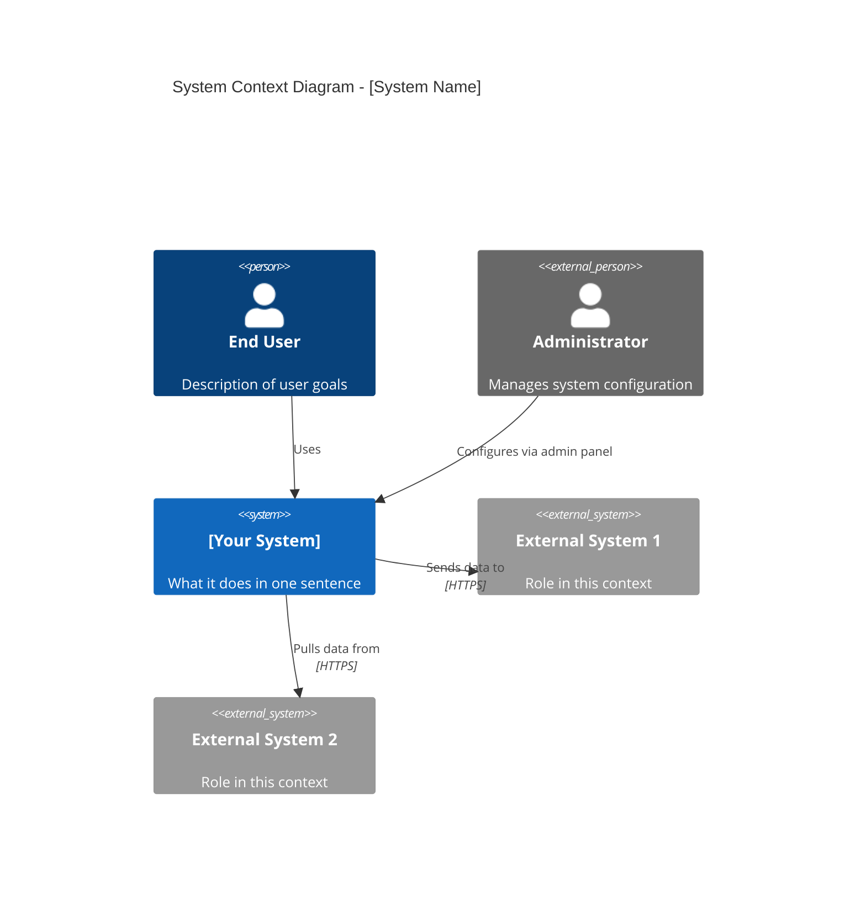

# /arch-doc

> Generate system or service architecture documentation with diagrams and component descriptions.

It also generates single C4 diagrams, exports the docs for publishing, and reviews existing docs for staleness and gaps.

## Trigger

`/arch-doc` -- invoked when creating or updating architecture documentation for a system or service.

`/arch-doc [diagram|export|review] [options]`

With no action, `/arch-doc` writes the full architecture documentation described under Process. ADRs have their own command, `/adr`.

## Actions

### `diagram`
Generate a C4 diagram in Mermaid or Structurizr DSL.

```bash
/arch-doc diagram --level context --output ./docs/arch/context.md
/arch-doc diagram --level container --format structurizr --output ./docs/arch/workspace.dsl
/arch-doc diagram --level component --service orders-service
```

### `export`
Export architecture documentation for publishing (HTML, PDF, Confluence).

```bash
/arch-doc export --format html --output ./dist/architecture
/arch-doc export --format confluence --space ARCH
```

### `review`
Review existing architecture docs for staleness, gaps, and inconsistencies.

```bash
/arch-doc review ./docs/arch/
/arch-doc review --check-adr-coverage   # Flag architectural decisions not covered by an ADR
```

## Input

| Parameter | Required | Description |
|-----------|----------|-------------|
| `--scope <level>` | No | Scope: `full-system`, `service`, `component` (default: `full-system`) |
| `--name <service>` | No | Service or component name (required when scope is `service` or `component`) |
| `--diagrams <types>` | No | Diagram types: `context`, `container`, `sequence`, `deployment` (default: all) |
| `--output <path>` | No | Output path (default: `docs/architecture/`) |

## Options for diagram, export, and review

| Option | Description |
|--------|-------------|
| `--level <n>` | C4 level: context, container, component, code |
| `--format <type>` | mermaid, structurizr, plantuml (default: mermaid) |
| `--output <path>` | Output file path |
| `--service <name>` | Scope to a specific service/container |
| `--status <status>` | ADR status: proposed, accepted, deprecated, superseded |
| `--supersedes <id>` | ADR number this record supersedes |

## Process

1. **Codebase Analysis**
   - Scan project structure to identify services, packages, modules
   - Read configuration files for infrastructure details (Docker, Terraform, K8s)
   - Identify external dependencies from package files and imports
   - Map communication patterns (HTTP, queues, events, database)

2. **Diagram Generation**
   - Generate Mermaid diagrams for each requested level
   - System context: users, external systems, system boundary
   - Container: deployable units and their relationships
   - Sequence: key request flows through the system
   - Deployment: infrastructure and hosting topology

3. **Narrative Writing**
   - Write component descriptions for each box in the diagrams
   - Trace data flows through the system with numbered steps
   - Document external dependencies with failure impact
   - Note scaling characteristics and bottlenecks

4. **Assembly**
   - Organize into a single document or linked pages
   - Add table of contents for navigation
   - Include diagram rendering instructions

## Output

Architecture documentation at the specified output path:

```
Architecture Documentation Generated
  Scope: Full System
  Diagrams: 4 (context, container, 2 sequence flows)
  Components Documented: 8
  External Dependencies: 5
  Output: docs/architecture/README.md
```
## C4 Context Diagram (Mermaid template)


