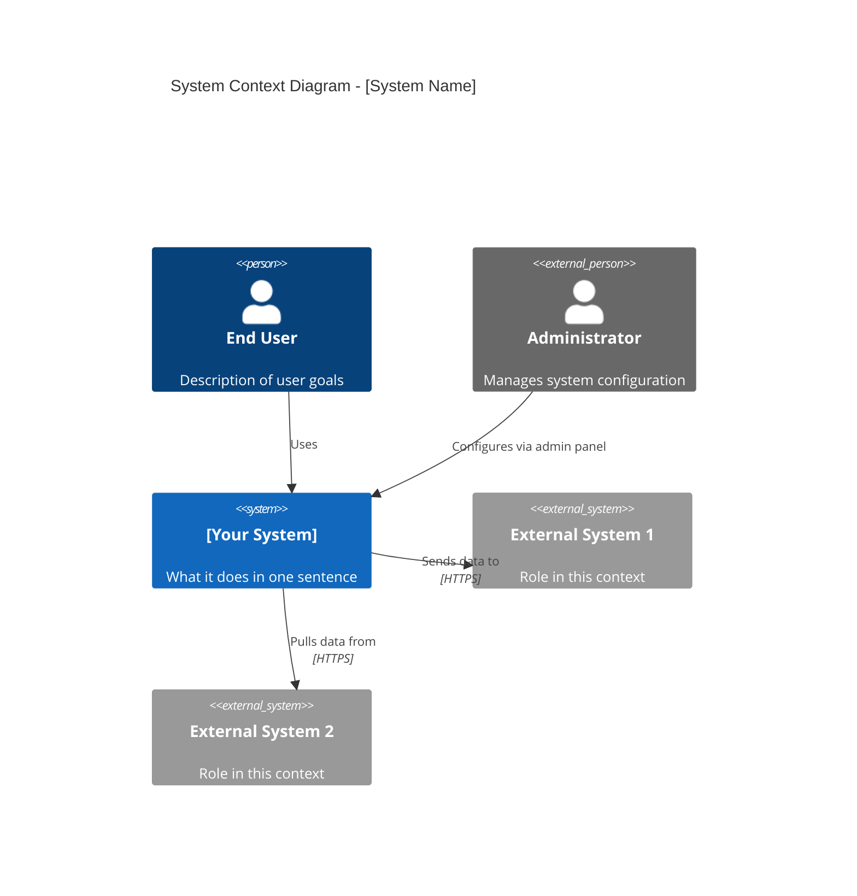

# /doc-architecture

Generate C4 diagrams, write ADRs, export architecture docs, and review existing architecture documentation.

## Trigger

`/doc-architecture <action> [options]`

## Actions

### `diagram`
Generate a C4 diagram in Mermaid or Structurizr DSL.

```bash
/doc-architecture diagram --level context --output ./docs/arch/context.md
/doc-architecture diagram --level container --format structurizr --output ./docs/arch/workspace.dsl
/doc-architecture diagram --level component --service orders-service
```

### `adr`
Create a new Architecture Decision Record.

```bash
/doc-architecture adr --title "Adopt GraphQL for client API" --status proposed
/doc-architecture adr --title "Replace MongoDB with PostgreSQL" --supersedes ADR-0003
/doc-architecture adr --list                # Show all ADRs with status
```

### `export`
Export architecture documentation for publishing (HTML, PDF, Confluence).

```bash
/doc-architecture export --format html --output ./dist/architecture
/doc-architecture export --format confluence --space ARCH
```

### `review`
Review existing architecture docs for staleness, gaps, and inconsistencies.

```bash
/doc-architecture review ./docs/arch/
/doc-architecture review --check-adr-coverage   # Flag architectural decisions not covered by an ADR
```

## Options

| Option | Description |
|--------|-------------|
| `--level <n>` | C4 level: context, container, component, code |
| `--format <type>` | mermaid, structurizr, plantuml (default: mermaid) |
| `--output <path>` | Output file path |
| `--service <name>` | Scope to a specific service/container |
| `--status <status>` | ADR status: proposed, accepted, deprecated, superseded |
| `--supersedes <id>` | ADR number this record supersedes |

## Template: ADR (MADR Format)

```markdown
# ADR-0015: Use CQRS for Reporting Queries

- **Status**: Proposed
- **Date**: 2025-04-01
- **Deciders**: Engineering leads, Product team
- **Supersedes**: N/A

## Context and Problem Statement

Report queries on the `orders` table are causing 5-8 second response times
during peak traffic. The same table handles write-heavy order processing.
We need to serve complex aggregation queries without degrading write throughput.

## Decision Drivers

- P95 report load time must be < 2 seconds
- Write throughput must not decrease below current 500 orders/min
- Solution must be maintainable by a 3-person backend team
- No additional operational complexity for the on-call rotation

## Considered Options

1. Read replicas with query routing
2. CQRS with a separate read model (proposed)
3. Materialized views in PostgreSQL
4. Move reporting to a data warehouse (Redshift/BigQuery)

## Decision Outcome

**Chosen option: CQRS with separate read model**

In the context of reporting query performance degradation, facing the conflict
between read and write workloads on a shared table, we decided for CQRS with
a separate read model, to achieve query isolation and sub-2s report times,
accepting the operational overhead of maintaining event projection workers.

### Consequences

**Positive:**
- Report queries run against a dedicated, optimized read model
- Write path is unaffected by reporting load
- Read model schema can be optimized for specific report shapes

**Negative:**
- Eventual consistency: reports lag writes by ~500ms
- New operational concern: event projection workers must be monitored
- Additional infrastructure: read model store (PostgreSQL read replica or separate DB)

## Options Analysis

| Option | Write Impact | Read Performance | Complexity | Cost |
|--------|-------------|-----------------|------------|------|
| Read replicas | None | Medium | Low | Low |
| CQRS read model | None | High | High | Medium |
| Materialized views | Low | High | Medium | None |
| Data warehouse | None | Very High | High | High |

## Related Decisions

- ADR-0008: Use PostgreSQL as primary datastore
- ADR-0011: Event-driven architecture for order state changes

## Notes

Revisit if the team grows beyond 8 engineers, at which point a dedicated
data engineering function may justify a full data warehouse approach.
```

## C4 Context Diagram (Mermaid template)


