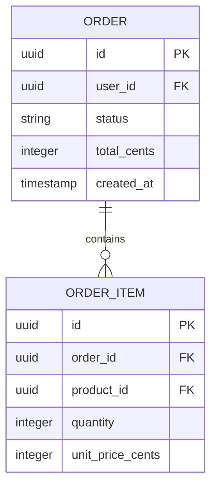

# Architecture Documentation Patterns

## C4 Model Patterns

### Level selection guide

| Audience | Level | Format |
|----------|-------|--------|
| Executive sponsor, non-technical stakeholders | L1 Context | One diagram, one page |
| Product managers, frontend developers, DevOps | L2 Container | 1-2 diagrams with tech annotations |
| Backend developers maintaining a service | L3 Component | Per-service, updated when structure changes |
| Code reviewers | L4 Code | Auto-generate from IDE; rarely hand-authored |

### Naming containers for humans
```
# Bad: names a technology
"Express.js Server"
"React Frontend"
"Redis"

# Good: names the capability, technology as annotation
"API Gateway [Node.js/Express]" - Routes and authenticates all client requests
"Customer Portal [React SPA]" - Self-service account and billing management
"Session Cache [Redis]" - Stores active user sessions with 30-min TTL
```

### Relationship labels
Always label relationships with the communication mechanism:

```mermaid
Rel(spa, api, "Calls", "HTTPS/REST")
Rel(api, orders, "Publishes events to", "AMQP")
Rel(orders, db, "Persists to", "PostgreSQL wire protocol")
Rel(worker, queue, "Consumes from", "SQS long-poll")
```

### Boundary definition
System boundary = what your team owns and can change. External = everything else.

```mermaid
System_Boundary(platform, "Payments Platform") {
  Container(api, "Payments API", "Go", "Charge, refund, dispute")
  Container(worker, "Settlement Worker", "Go", "Daily batch reconciliation")
  ContainerDb(db, "Payments DB", "PostgreSQL")
}

# These are external - your team does not change them:
System_Ext(stripe, "Stripe", "Card network processing")
System_Ext(bank, "Banking Partner", "ACH transfers")
```

## ADR Patterns

### Concrete consequences over vague risks

```markdown
# Bad
**Negative:**
- May have performance implications
- Could increase complexity

# Good
**Negative:**
- Read model lags writes by ~500ms; dashboards will not show real-time data
- Two additional services to monitor (projection worker, read model store)
- Schema changes require updating both write model migration AND read model projection
```

### Y-Statement for the decision line

Template: "In the context of [situation], facing [concern], we decided for [option], to achieve [quality], accepting [downside]."

```markdown
In the context of choosing a caching strategy for product catalog data,
facing read throughput of 5,000 requests/second exceeding PostgreSQL capacity,
we decided for Redis with a write-through cache pattern,
to achieve sub-10ms read latency for catalog queries,
accepting that cache invalidation logic adds complexity to the write path.
```

### Options analysis table

Every ADR should include a comparison table. Minimum columns: option, key benefit, key cost, reason accepted/rejected.

```markdown
| Option | Benefit | Cost | Verdict |
|--------|---------|------|---------|
| Redis write-through | Sub-10ms reads | Cache invalidation complexity | **Chosen** |
| Read replicas | Simple, PostgreSQL-native | 50-100ms replication lag | Rejected: latency too high |
| In-memory (application) | Zero network hops | No shared state across instances | Rejected: stale data risk |
| CDN edge caching | Global distribution | Cache headers complexity, 60s staleness | Deferred to v2 |
```

## arc42 Section Priorities

Not every project needs all 12 arc42 sections. Prioritize:

**Always write:**
- Section 1: Requirements and goals (what constraints shape this architecture)
- Section 5: Building block view (L2 C4 diagram)
- Section 9: Architecture decisions (ADR index)
- Section 11: Technical risks (the most useful section for newcomers)

**Write when relevant:**
- Section 3: System scope and context (if external integrations are complex)
- Section 8: Cross-cutting concepts (if auth, logging, error handling are non-obvious)
- Section 10: Quality scenarios (if there are strict SLAs or NFRs)

**Skip or defer:**
- Section 7: Deployment view (use runbooks instead unless deployment is unusual)
- Section 12: Glossary (only if domain terminology is genuinely confusing)

## Mermaid Diagram Patterns

### Sequence diagram for API flows
```mermaid
sequenceDiagram
  participant Client
  participant Gateway as API Gateway
  participant Auth as Auth Service
  participant Orders as Order Service
  participant DB as PostgreSQL

  Client->>Gateway: POST /orders (Bearer token)
  Gateway->>Auth: Validate token
  Auth-->>Gateway: {user_id, scopes}
  Gateway->>Orders: createOrder(user_id, items)
  Orders->>DB: BEGIN; INSERT order; COMMIT
  DB-->>Orders: order_id
  Orders-->>Gateway: 201 Created {order_id}
  Gateway-->>Client: 201 Created {order_id}
```

### ER diagram for data models


## Anti-Patterns

### Diagram rot
Diagrams that were accurate 18 months ago but no longer reflect reality. Solution: tie diagram updates to architectural change tasks, not documentation sprints.

### One-level-fits-all
Using only L1 context diagrams for developers, or only L3 component diagrams for executives. Match diagram detail to audience.

### Technology-first naming
Naming containers by technology ("MongoDB cluster", "Lambda function") instead of capability ("User Profile Store", "Image Resize Worker"). Technologies change; capabilities persist.

### ADR as post-hoc justification
Writing an ADR that presents only the chosen option without alternatives. If no alternatives are considered, it is not a decision record.

### Diagrams as decoration
Including architecture diagrams in documentation that nobody maintains. Either automate generation (Structurizr from code) or commit to a review cadence.

## References
- [C4 Model](https://c4model.com/) - Simon Brown
- [MADR](https://adr.github.io/madr/) - Markdown Architectural Decision Records
- [arc42](https://arc42.org/overview) - Architecture documentation template
- [Structurizr DSL](https://docs.structurizr.com/dsl) - Code-as-architecture-diagrams
- [Mermaid C4 diagrams](https://mermaid.js.org/syntax/c4.html)
