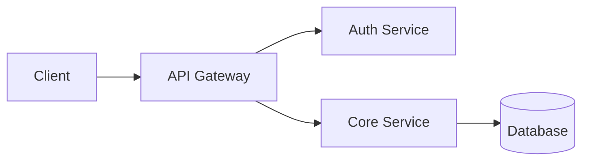

# README Templates

> Structural patterns and content frameworks for different project types.

## Knowledge Base

### The README Pyramid

Every README serves multiple audiences simultaneously. Structure content as a pyramid:

```
         [Title + One-liner]          <-- 2 seconds: "What is this?"
        [Badges + Visual]             <-- 5 seconds: "Is it healthy?"
       [Install + Quick Start]        <-- 30 seconds: "Can I use it?"
      [Features / API Overview]       <-- 2 minutes: "What can it do?"
     [Detailed Docs + Examples]       <-- 10 minutes: "How exactly?"
    [Contributing + License]          <-- When invested
```

### Section Content Guidelines

**Title**: Project name. No "Welcome to" or "About". Just the name.

**Description**: One sentence. Format: "{Name} is a {category} that {value proposition}."
- Good: "Zod is a TypeScript-first schema validation library with static type inference."
- Bad: "Welcome to Zod! This project aims to provide validation utilities for TypeScript developers."

**Install**: Show every supported package manager. Most common first.
```markdown
## Install

npm:
\`\`\`bash
npm install project-name
\`\`\`

Yarn:
\`\`\`bash
yarn add project-name
\`\`\`

pnpm:
\`\`\`bash
pnpm add project-name
\`\`\`
```

**Quick Start**: The minimum code to see the project work. Under 15 lines. Must be copy-pasteable.

**API Reference**: For libraries. Table format for simple APIs, linked subpages for complex ones.

**Configuration**: Show the config file format with comments explaining each option. Show defaults.

### Expandable Sections for Long Content

```markdown
<details>
<summary>Advanced Configuration</summary>

Content that most readers don't need goes here.
It stays out of the way but is accessible.

</details>
```

### Table of Contents

Include a TOC for READMEs longer than 4 screenfuls:

```markdown
## Table of Contents

- [Install](#install)
- [Quick Start](#quick-start)
- [API](#api)
- [Configuration](#configuration)
- [Contributing](#contributing)
- [License](#license)
```

### Visual Elements

**Screenshots**: Use for GUIs, dashboards, CLI output. Place after description, before install.

```markdown
<p align="center">
  
</p>
```

**Architecture Diagrams**: Use for complex systems. Mermaid works in GitHub:

````markdown

````

**Demo GIFs**: Use for CLI tools and interactive features. Keep under 5 seconds, under 5MB.

## Patterns

1. **One-Liner Test**: If you can't describe the project in one sentence, the project scope is unclear.
2. **Copy-Paste Test**: Every code example should work when pasted into a fresh project with only the documented prerequisites.
3. **5-Second Test**: A developer should know what the project does within 5 seconds of landing on the README.
4. **Heading Scan Test**: Reading only the headings should tell the story: what, install, use, configure, contribute.
5. **Link Everything**: Every mention of an external tool, service, or concept should link to its documentation.
6. **Version Pinning**: Show version-specific install commands when relevant: `npm install project@^3.0.0`.

## Anti-Patterns

1. **Wall of Text**: No paragraphs longer than 4 lines. Use lists, tables, and code blocks.
2. **Logo Without Substance**: A giant logo with minimal documentation. Content first, branding second.
3. **Stale Badges**: Badges showing failing CI or outdated versions. Remove badges you cannot maintain.
4. **TOC-Only README**: A README that is just a table of contents linking to a docs/ folder. The README must stand alone.
5. **"Under Construction"**: If it is not ready, don't publish it. If it is published, document what exists.
6. **Assumed Knowledge**: "Just run `make`" without explaining prerequisites. Always list dependencies.
7. **Screenshot Overload**: More than 3 screenshots in sequence. Use a gallery link or docs page.

## References

- [Make a README](https://www.makeareadme.com/)
- [Awesome README](https://github.com/matiassingers/awesome-readme)
- [Standard Readme](https://github.com/RichardLitt/standard-readme)
- [GitHub Flavored Markdown Spec](https://github.github.com/gfm/)
- [Shields.io](https://shields.io/)
